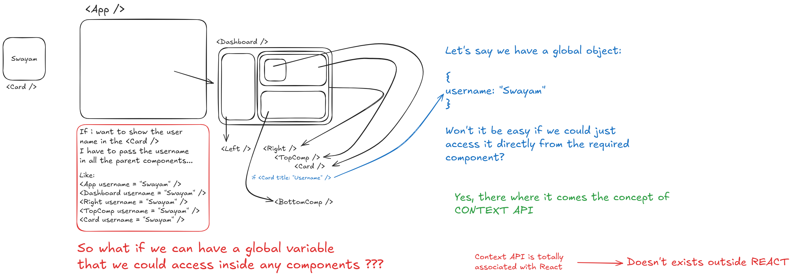

# � Learning React Context API - My Journey

This is my **learning project** to understand React Context API! I built this simple login/profile app to grasp how data flows between components without passing props down multiple levels.

## 🎯 Why I Built This

Before Context API, I was struggling with **prop drilling** - passing data through multiple components just to reach a child component. This project helped me understand:

- How to share state globally in a React app
- When Context API is useful vs when it's overkill
- The difference between local state and global state
- How to avoid the "props hell" problem

## 🧠 What I Learned

### The Problem I Was Solving

Imagine having user login data in a parent component, but needing it in a deeply nested child component. Without Context API, I'd have to pass it through every component in between, even if they don't need it!



### My "Aha!" Moments

1. **Context is like a global variable** - but better and React-friendly
2. **Provider wraps components** that need the data
3. **useContext hook** lets any component grab the data directly
4. **No more prop drilling** - components can access what they need

## � How I Approached Learning

### Step 1: Understanding the Concept

I started by learning that Context API solves the prop drilling problem. I drew diagrams (on Excalidraw!) to visualize how data flows.

### Step 2: Building the Basic Structure

```
1. Created UserContext.js - The "global storage"
2. Built UserContextProvider.jsx - The "wrapper" that provides data
3. Made Login.jsx - Component that SETS the user data
4. Made Profile.jsx - Component that READS the user data
```

### Step 3: Connecting the Dots

The magic happens when I wrap my App with the Provider - suddenly all child components can access user data!

## � What I Built (Learning Project)

A super simple login system where:

- User enters username/password in Login component
- Profile component shows "please login" OR "Welcome [username]"
- Both components share the same user state through Context
- Added logout functionality to see state changes in action

## 💡 Key Concepts I Grasped

### 1. **Creating Context** (The Global Storage)

```javascript
// This creates an empty "box" to store data
const UserContext = React.createContext();
```

**My Understanding:** Think of this as creating a storage container that any component can access.

### 2. **Provider Component** (The Data Distributor)

```jsx
// This component actually holds and shares the data
const UserContextProvider = ({ children }) => {
  const [user, setUser] = useState(null); // The actual state
  return (
    <UserContext.Provider value={{ user, setUser }}>
      {children} {/* Any component inside can access user data */}
    </UserContext.Provider>
  );
};
```

**My Understanding:** Provider is like a parent who gives allowance to all their children - but here it's data instead of money!

### 3. **Consuming Context** (Grabbing the Data)

```jsx
// Any component can grab the data like this
const { user, setUser } = useContext(UserContext);
```

**My Understanding:** It's like having a direct phone line to the data source - no need to ask parents to ask grandparents!

## � My Project Structure (Learning-Focused)

```
src/
├── context/
│   ├── UserContext.js          # 📦 The "storage box" I created
│   └── UserContextProvider.jsx # 🎁 The "gift giver" component
├── components/
│   ├── Login.jsx               # ✏️  Where user ENTERS data
│   └── Profile.jsx             # 👀 Where user SEES their data
└── App.jsx                     # 🏠 The house that wraps everything
```

**Why this structure helped me learn:**

- Separated context logic from UI components
- Made it clear what each file does in the Context pattern
- Easy to see the data flow: Context → Provider → Components

## 🔧 What Each File Taught Me

### `UserContext.js` - The Foundation

**What it does:** Creates the context
**What I learned:** This is just creating the "container" - it doesn't hold data yet!

### `UserContextProvider.jsx` - The Manager

**What it does:** Actually manages the state and provides it to children
**What I learned:** This is where the real magic happens - useState + Provider = global state!

### `Login.jsx` - The State Updater

**What it does:** Updates the global user state
**What I learned:** Any component can change global state using the context!

### `Profile.jsx` - The State Reader

**What it does:** Reads and displays user state
**What I learned:** Components can access state without knowing where it comes from!

## After This Project:

- ✅ Understand the Provider pattern clearly
- ✅ Know how to share state without prop drilling
- ✅ Can identify when Context API is useful
- ✅ Confident with useContext hook
- ✅ Understand component composition better

## 🤓 My Learning Process

1. **Visual Learning**: Drew diagrams on Excalidraw to understand data flow
2. **Hands-on Practice**: Built this simple but complete example
3. **Breaking it Down**: Separated each concept into its own file
4. **Testing Understanding**: Added features like logout to see if I really got it
---

## 💭 Final Thoughts

This project was a **game-changer** for my React understanding! Context API seemed scary at first, but building this simple example made it click. Now I can see how powerful it is for sharing state across an entire app.

**The biggest lesson:** Start simple, understand the basics, then build complexity. This tiny login example taught me more than reading a hundred tutorials!

> **Note to future me:** Remember that Context API isn't always the answer - sometimes simple props are better. Use Context when you have data that multiple components at different levels need to access.

**Happy Learning! 🚀**
