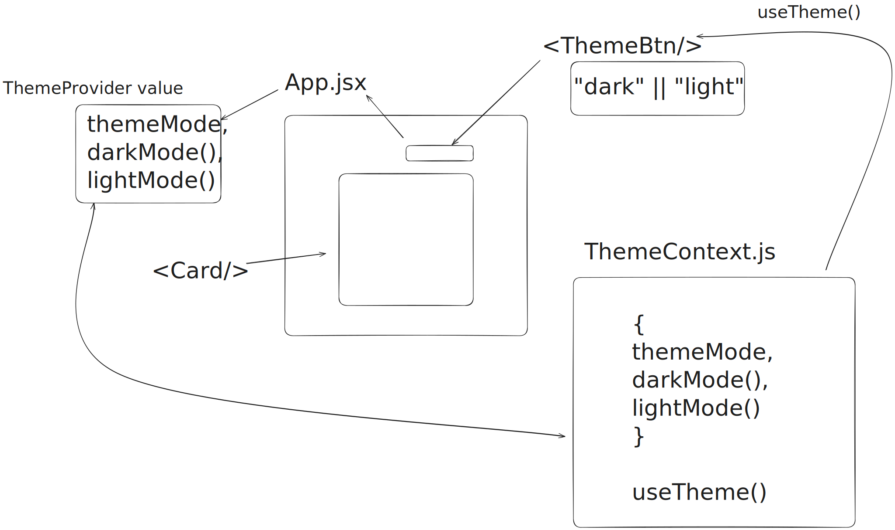

# 🌙 Theme Switcher - Context API Learning Project

A practical React project where I learned advanced Context API patterns by building a dark/light theme switcher with persistence and system preference detection.

## 🎯 Learning Goals & Outcomes

**Why Theme Switching?** Perfect Context API use case - global state needed throughout the app without prop drilling.

**Progression from [06miniContext](../06miniContext):** Moved from basic login state to real-world theme management with DOM integration and persistence.

## 🏗️ What I Built

### Core Features

- **🌙 Theme Toggle**: Seamless dark/light mode switching
- **💾 Smart Persistence**: localStorage + system preference detection
- **🎨 TailwindCSS Integration**: Dynamic theme classes
- **⚡ Real-time Updates**: Instant theme changes across components

### Architecture

```
src/
├── contexts/ThemeContext.js    # Context + custom hook
├── components/
│   ├── ThemeBtn.jsx           # Toggle switch
│   └── Card.jsx               # Example themed component
└── App.jsx                    # Provider setup + state management
```

## 💡 Key Learning Breakthroughs

### 1. **Advanced Context Pattern**

```jsx
// ThemeContext.js - Production pattern
export const ThemeContext = createContext({
  themeMode: "light",
  darkMode: () => {},
  lightMode: () => {},
});

export const ThemeProvider = ThemeContext.Provider;
export default function useTheme() {
  return useContext(ThemeContext);
}
```

### 2. **Smart State Initialization**

```jsx
const [themeMode, setThemeMode] = useState(() => {
  const saved = localStorage.getItem("themeMode") || "light";
  if (saved) return saved;

  // System preference fallback
  return window.matchMedia("(prefers-color-scheme: dark)").matches
    ? "dark"
    : "light";
});
```

**Learning:** Priority-based initialization: saved → system → default

### 3. **Context + DOM Integration**

```jsx
useEffect(() => {
  localStorage.setItem("themeMode", themeMode);
  document.documentElement.classList.remove("light", "dark");
  document.documentElement.classList.add(themeMode);
}, [themeMode]);
```

**Breakthrough:** Context can trigger real DOM changes, not just React re-renders!

### 4. **Clean Component Consumption**

```jsx
// ThemeBtn.jsx
const { themeMode, darkMode, lightMode } = useTheme();
const onChangeBtn = (e) => {
  e.currentTarget.checked ? darkMode() : lightMode();
};
```

## 🎨 Architecture Visualization

**Before Context API:**

```
App → Components (prop drilling nightmare)
```

**After Context API:**

```
App (ThemeProvider)
├── ThemeBtn (direct access!)
└── Card (benefits from DOM classes)
```

## 📈 Skills Progression

| Concept              | 06miniContext  | 07themeSwitcher              |
| -------------------- | -------------- | ---------------------------- |
| **State Management** | Basic useState | Lazy init + system detection |
| **Persistence**      | None           | localStorage + preferences   |
| **DOM Integration**  | React only     | HTML class manipulation      |
| **Real-world Usage** | Login practice | Production-ready theming     |

## 🎯 Key Takeaways

1. **Context API shines** for app-wide state like themes
2. **Smart initialization** with fallback strategies improves UX
3. **Context + useEffect** can control the entire DOM
4. **Custom hooks** make context consumption cleaner
5. **Production patterns** matter for maintainable code

## 📸 Project Demo

### Light Mode


### Dark Mode


### Architecture Diagram



## 📋 My Learning Notes

For detailed step-by-step notes from my learning process, check out:

- **[Visual Notes](./src/assets/notes/notes.svg)** - My step-by-step learning diagrams

---

> **Note to future me**: Context re-renders all consumers when value changes. Fine for themes, but consider performance for frequently changing data.
