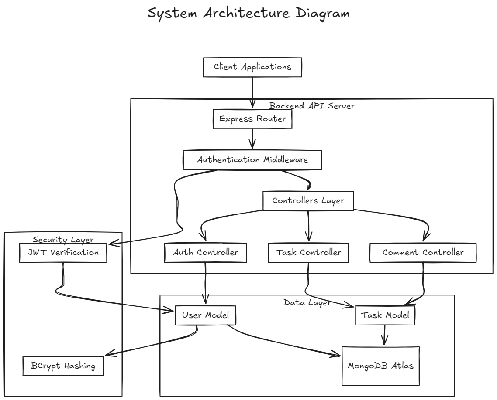
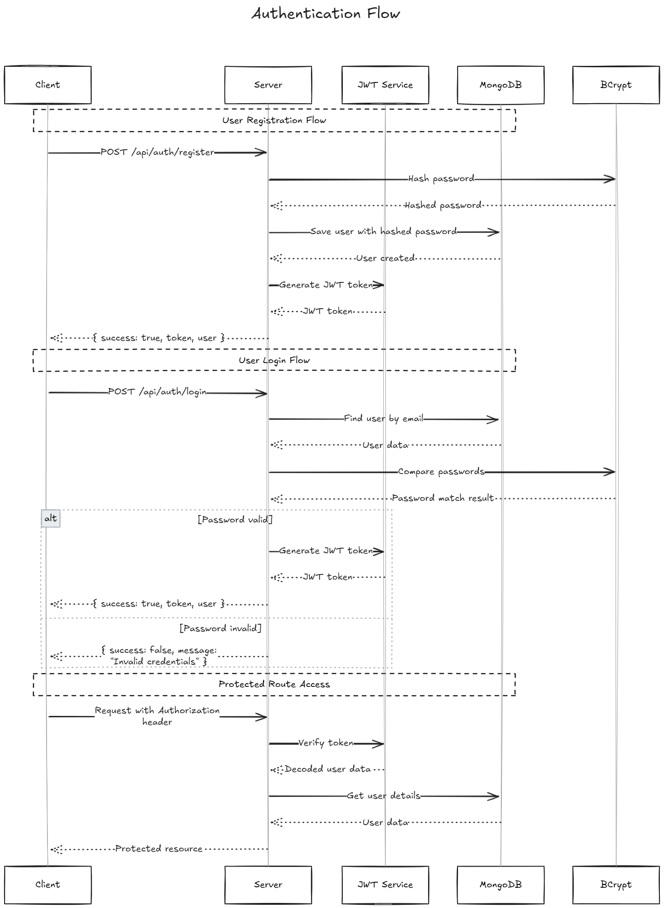
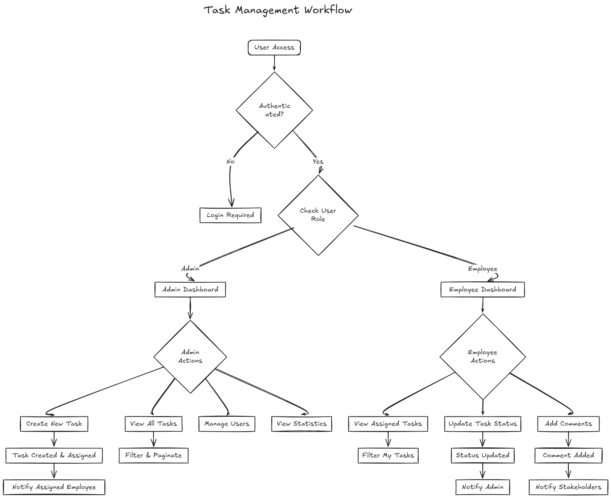
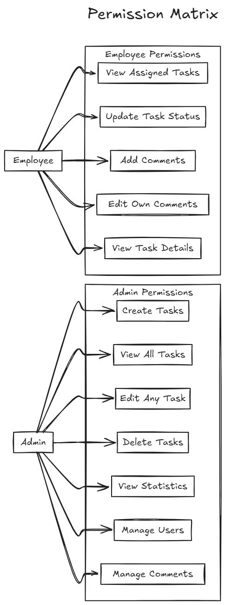
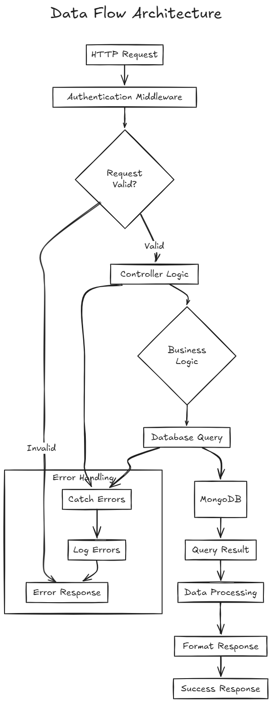
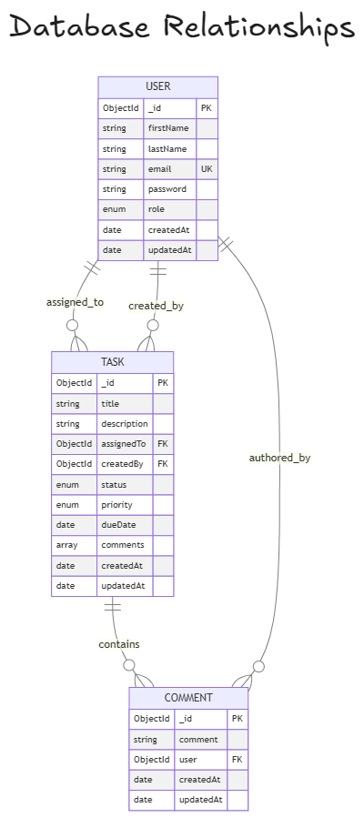
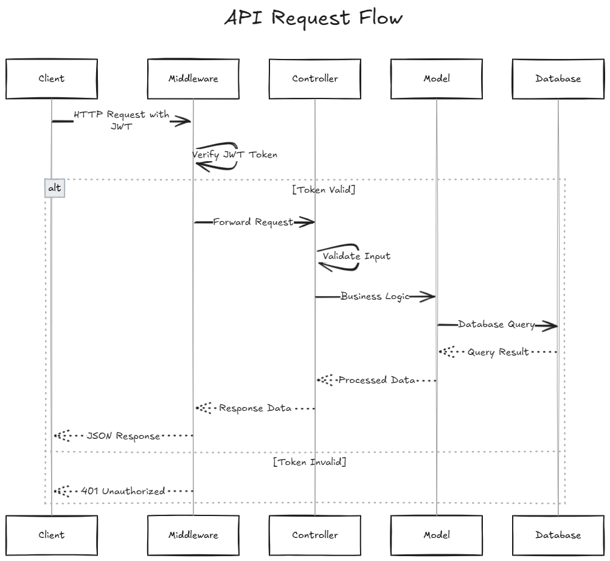

# Employee Management System - Backend API

A production-ready RESTful API for employee and task management, built with Node.js, Express, and MongoDB.

## 🚀 Features

- **Authentication & Authorization**: JWT-based auth with role-based access control (Admin/Employee)
- **Task Management**: Complete CRUD operations with advanced filtering and statistics
- **Comment System**: Collaborative commenting on tasks
- **User Management**: Secure user registration and profile management
- **Data Validation**: Comprehensive input validation and error handling
- **Security**: Password hashing, protected routes, and input sanitization

## 🛠️ Tech Stack

- **Backend**: Node.js, Express.js
- **Database**: MongoDB with Mongoose ODM
- **Authentication**: JSON Web Tokens (JWT)
- **Security**: bcryptjs for password hashing
- **Validation**: Built-in Express validators

## 📁 Project Structure

```
backend/
├── config/
│   └── database.js          # MongoDB connection configuration
├── controllers/
│   ├── authController.js    # Authentication logic
│   ├── taskController.js    # Task management operations
│   └── commentController.js # Comment system operations
├── middleware/
│   └── auth.js             # JWT authentication middleware
├── models/
│   ├── User.js             # User schema and methods
│   └── Task.js             # Task schema and relationships
├── routes/
│   ├── auth.js             # Authentication routes
│   └── tasks.js            # Task and comment routes
├── utils/
├── .env                    # Environment variables
├── .gitignore             # Git ignore rules
├── package.json           # Dependencies and scripts
└── server.js              # Application entry point
```

## 📚 API Documentation

### Authentication Endpoints

#### Register User

```http
POST /api/auth/register
Content-Type: application/json

{
  "firstName": "John",
  "lastName": "Doe",
  "email": "john.doe@example.com",
  "password": "securePassword123",
  "role": "employee"
}
```

#### Login User

```http
POST /api/auth/login
Content-Type: application/json

{
  "email": "john.doe@example.com",
  "password": "securePassword123"
}
```

### Task Management Endpoints

#### Create Task (Admin Only)

```http
POST /api/tasks
Authorization: Bearer <jwt_token>
Content-Type: application/json

{
  "title": "Implement user authentication",
  "description": "Add JWT-based authentication to the application",
  "assignedTo": "user_id",
  "priority": "high",
  "dueDate": "2025-08-20"
}
```

#### Get All Tasks

```http
GET /api/tasks?page=1&limit=10&status=pending&priority=high
Authorization: Bearer <jwt_token>
```

#### Update Task Status

```http
PUT /api/tasks/:id/status
Authorization: Bearer <jwt_token>
Content-Type: application/json

{
  "status": "in-progress"
}
```

#### Delete Task (Admin Only)

```http
DELETE /api/tasks/:id
Authorization: Bearer <jwt_token>
```

### Comment Endpoints

#### Add Comment to Task

```http
POST /api/tasks/:id/comments
Authorization: Bearer <jwt_token>
Content-Type: application/json

{
  "comment": "Task is progressing well, will complete by tomorrow."
}
```

#### Update Comment

```http
PUT /api/tasks/:taskId/comments/:commentId
Authorization: Bearer <jwt_token>
Content-Type: application/json

{
  "comment": "Updated progress: 80% complete."
}
```

#### Delete Comment

```http
DELETE /api/tasks/:taskId/comments/:commentId
Authorization: Bearer <jwt_token>
```

### Statistics Endpoint

#### Get Task Statistics (Admin Only)

```http
GET /api/tasks/stats
Authorization: Bearer <jwt_token>
```

Returns comprehensive statistics including task counts by status, priority distribution, and user-wise task allocation.

## 🔐 Security Features

- **JWT Authentication** with configurable expiration
- **Password Hashing** using bcrypt with salt rounds
- **Role-based Access Control** preventing unauthorized operations
- **Input Validation** with comprehensive error handling
- **MongoDB Injection Protection** through Mongoose validation
- **CORS Configuration** for cross-origin requests

## 🏗️ Architecture Patterns

### MVC Pattern

- **Models**: Data structure and database interaction
- **Views**: JSON API responses
- **Controllers**: Business logic and request handling

### Middleware Pattern

- Authentication middleware for protected routes
- Error handling middleware for consistent responses
- Request logging for debugging and monitoring

### Repository Pattern

- Abstracted database operations
- Reusable query functions
- Separation of concerns

## 📊 Database Schema

### User Model

```javascript
{
  firstName: String (required),
  lastName: String (required),
  email: String (unique, required),
  password: String (hashed),
  role: Enum ['admin', 'employee'],
  createdAt: Date,
  updatedAt: Date
}
```

### Task Model

```javascript
{
  title: String (required),
  description: String,
  assignedTo: ObjectId (ref: User),
  createdBy: ObjectId (ref: User),
  status: Enum ['pending', 'in-progress', 'completed', 'cancelled'],
  priority: Enum ['low', 'medium', 'high', 'critical'],
  dueDate: Date,
  comments: [Comment Schema],
  createdAt: Date,
  updatedAt: Date
}
```

## 🧪 Testing

### Manual Testing with Postman

1. Import the API collection from `/docs/postman-collection.json`
2. Set up environment variables for base URL and JWT token
3. Test all endpoints with various scenarios

### Automated Testing (Future Enhancement)

- Unit tests with Jest
- Integration tests for API endpoints
- Database testing with MongoDB Memory Server

## 🚀 Performance Optimizations

- **Database Indexing** on frequently queried fields
- **Pagination** for large datasets
- **Population Control** to avoid over-fetching
- **Aggregation Pipelines** for complex queries
- **Connection Pooling** for database efficiency

## 🔄 Deployment

### Environment Setup

- Production MongoDB Atlas cluster
- Environment-specific configuration
- JWT secret management
- CORS configuration for production domains

### Docker Support (Future Enhancement)

```dockerfile
FROM node:16-alpine
WORKDIR /app
COPY package*.json ./
RUN npm ci --only=production
COPY . .
EXPOSE 5000
CMD ["npm", "start"]
```

## 🐛 Error Handling

The API implements comprehensive error handling:

- **Validation Errors**: 400 Bad Request with detailed messages
- **Authentication Errors**: 401 Unauthorized
- **Authorization Errors**: 403 Forbidden
- **Not Found Errors**: 404 with descriptive messages
- **Server Errors**: 500 with error logging

## Diagrams

## 

## 

## 

## 

## 

## 

## 

## 📈 Future Enhancements

- [ ] Real-time notifications with Socket.io
- [ ] File upload functionality for task attachments
- [ ] Email notifications for task assignments
- [ ] Advanced reporting and analytics
- [ ] API rate limiting and throttling
- [ ] Audit logs for all operations
- [ ] Advanced search with full-text indexing
- [ ] Task dependencies and workflows
- [ ] Time tracking for tasks
- [ ] Integration with external calendar systems

## 📄 License

This project is licensed under the MIT License - see the [LICENSE](LICENSE) file for details.

## 👨‍💻 Author

**Swayam Yadav**

- GitHub: [@swayamyadav05](https://github.com/swayamyadav05)
- LinkedIn: [Connect with me](https://linkedin.com/in/swayamyadav05)

## 🙏 Acknowledgments

- Express.js community for excellent documentation
- MongoDB team for the powerful database solution
- JWT.io for authentication standards
- The Node.js community for continuous innovation

---

_Built with ❤️ and lots of ☕_
